# 🏗️ Arquitetura do Sistema

Este documento explica a arquitetura técnica do sistema de fine-tuning PTT5, detalhando cada componente e suas interações.

## 🎯 Visão Geral da Arquitetura

O sistema implementa uma arquitetura modular baseada em três pilares principais:

1. **Quantização 4-bit**: Redução de uso de memória
2. **QLoRA**: Combinação de quantização com adaptadores LoRA
3. **Pipeline de Treinamento**: Processamento completo end-to-end

## 🧩 Componentes Principais

### 1. Modelo Base (PTT5)

```python
model_name = "unicamp-dl/ptt5-base-portuguese-vocab"
```

**Por que PTT5?**
- Modelo T5 específico para português
- Arquitetura sequence-to-sequence
- Pré-treinado em corpus português
- Tamanho otimizado (220M parâmetros)

### 2. Quantização 4-bit

```python
bnb_config = BitsAndBytesConfig(
    load_in_4bit=True,
    bnb_4bit_use_double_quant=True,
    bnb_4bit_quant_type="nf4",
    bnb_4bit_compute_dtype=torch.float16
)
```

**Como funciona:**
- **4-bit**: Cada peso usa apenas 4 bits (vs 32 bits padrão)
- **Double Quantization**: Quantiza também os fatores de escala
- **NF4**: Tipo de quantização Neural Float 4
- **Redução**: ~75% menos uso de memória

### 3. Adaptadores LoRA

```python
lora_config = LoraConfig(
    r=16,                    # Rank das matrizes
    lora_alpha=32,           # Fator de escala
    target_modules=["q", "v", "k", "o", "wi_0", "wi_1", "wo"],
    lora_dropout=0.1,
    bias="none",
    task_type="SEQ_2_SEQ_LM"
)
```

**Conceito LoRA:**
- Congela pesos originais do modelo
- Adiciona matrizes de baixo rank (A e B)
- Treina apenas ~0.1% dos parâmetros
- Mantém qualidade do modelo original

**Matemática:**
```
W_output = W_frozen + (A × B)
```

## 🔄 Pipeline de Processamento

### 1. Carregamento de Dados

```python
df = pd.read_excel(dataset_path)
df = validate_dataframe(df, required_columns)
```

**Validações aplicadas:**
- Verificação de colunas obrigatórias
- Limpeza de valores nulos
- Normalização de texto
- Remoção de registros inválidos

### 2. Preparação dos Dados

```python
train_data = prepare_data_for_fine_tuning(train_df, prompt_template)
```

**Transformação:**
```
Input: "Gere uma interpretação para a carta 'O Mago' em 'Ano Novo'..."
Output: "2025 é um ano para focar na sua capacidade..."
```

### 3. Tokenização

```python
tokenized_dataset = dataset.map(
    lambda x: tokenize_function(x, tokenizer, max_length=450),
    batched=True
)
```

**Processo:**
- Converte texto em tokens numéricos
- Aplica padding/truncation
- Cria máscaras de atenção
- Prepara labels para seq2seq

### 4. Treinamento

```python
trainer = Trainer(
    model=model,
    args=training_args,
    train_dataset=tokenized_train_dataset,
    eval_dataset=tokenized_val_dataset,
    data_collator=data_collator,
    compute_metrics=compute_metrics,
    callbacks=[early_stopping]
)
```

## 📊 Fluxo de Dados

```mermaid
graph TD
    A[Dataset Excel] --> B[Validação]
    B --> C[Divisão Train/Val]
    C --> D[Aplicação Template]
    D --> E[Tokenização]
    E --> F[Data Collator]
    F --> G[Modelo Quantizado]
    G --> H[Adaptadores LoRA]
    H --> I[Treinamento]
    I --> J[Avaliação]
    J --> K[Métricas ROUGE/BLEU]
    K --> L[Modelo Treinado]
```



## 🎛️ Configuração Avançada

### Parâmetros de Memória

```yaml
# Otimizações para GPU limitada
per_device_train_batch_size: 1
gradient_accumulation_steps: 8
gradient_checkpointing: true
dataloader_pin_memory: true
```

**Cálculos:**
- Batch efetivo = batch_size × accumulation_steps
- Memória = batch_size × sequence_length × hidden_size
- Checkpointing troca memória por computação

### Scheduler de Learning Rate

```yaml
learning_rate: 0.00002
lr_scheduler_type: "cosine"
warmup_ratio: 0.15
```

**Comportamento:**
- Aquecimento: 15% das épocas
- Decaimento cosseno: Suave redução
- Previne overfitting

## 🔍 Métricas de Avaliação

### ROUGE (Recall-Oriented Understudy for Gisting Evaluation)

```python
rouge_result = rouge.compute(
    predictions=decoded_preds,
    references=decoded_labels,
    use_stemmer=True
)
```

**Tipos:**
- **ROUGE-1**: Sobreposição de unigramas
- **ROUGE-2**: Sobreposição de bigramas
- **ROUGE-L**: Subsequência comum mais longa

### BLEU (Bilingual Evaluation Understudy)

```python
bleu_result = bleu.compute(
    predictions=decoded_preds,
    references=[[label] for label in decoded_labels]
)
```

**Características:**
- Métrica de precisão
- Penaliza textos muito curtos
- Considera n-gramas até ordem 4

## 🧠 Decodificação Robusta

### Tratamento de Estruturas Complexas

```python
def _handle_complex_structures(data):
    if isinstance(data, (list, tuple)):
        if len(data) > 0 and hasattr(data[0], 'shape'):
            data = data[0]
    return data
```

**Problemas resolvidos:**
- Formatos inconsistentes de predições
- Dimensões irregulares
- Tokens inválidos
- Estruturas aninhadas

## 🎯 Otimizações Implementadas

### 1. Uso de Memória

| Técnica | Redução | Aplicação |
|---------|---------|-----------|
| Quantização 4-bit | 75% | Pesos do modelo |
| Gradient Checkpointing | 50% | Ativações |
| LoRA | 99% | Parâmetros treináveis |

### 2. Velocidade de Treinamento

- **Mixed Precision (FP16)**: 2x mais rápido
- **DataLoader optimizado**: Paralelização
- **Gradient Accumulation**: Batch efetivo maior

### 3. Estabilidade

- **Early Stopping**: Previne overfitting
- **Gradient Clipping**: Previne explosão
- **Warmup**: Estabiliza início do treinamento

## 📁 Estrutura de Arquivos

```
sistema_le_mat/
├── train_model.py           # Pipeline principal
├── utils/
│   ├── data_processing.py   # Processamento de dados
│   └── evaluation_metrics.py # Métricas robustas
├── prompts/
│   └── pessoa_x_prompt.py   # Templates
└── config/
    └── training_config.yaml # Configurações
```

## 🔧 Pontos de Extensão

### Novos Templates

```python
# Adicionar em pessoa_x_prompt.py
NOVO_TEMPLATE = "Prompt personalizado para {contexto}..."
```

### Métricas Personalizadas

```python
# Adicionar em evaluation_metrics.py
def custom_metric(predictions, references):
    # Implementar nova métrica
    pass
```

### Configurações Específicas

```yaml
# Adicionar em training_config.yaml
custom_config:
  parameter: value
```

## 🚀 Próximos Desenvolvimentos

### Possíveis Melhorias

1. **Quantização 8-bit**: Alternativa à 4-bit
2. **Adapter Fusion**: Combinação de múltiplos adapters
3. **Prompt Tuning**: Otimização de prompts
4. **Multi-GPU**: Treinamento distribuído

### Experimentação

```python
# Área para testes
experimental_config = {
    'new_optimizer': 'AdamW',
    'custom_scheduler': 'polynomial',
    'advanced_quantization': True
}
```

---

**Próximo**: [Configuração do Sistema](configuration.md)